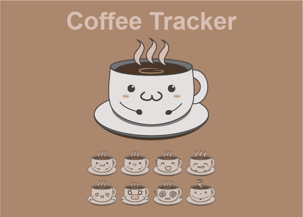
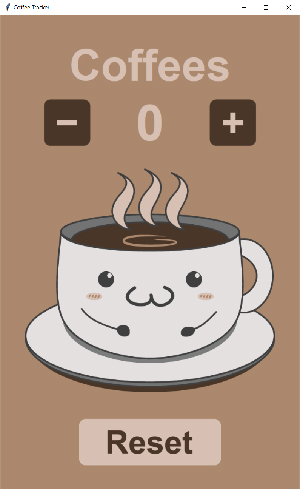
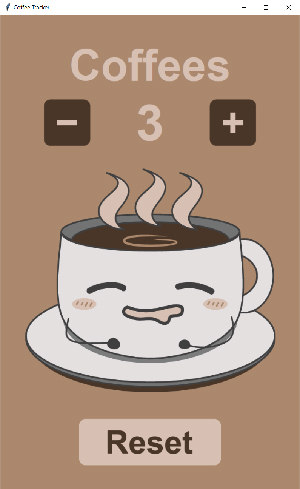
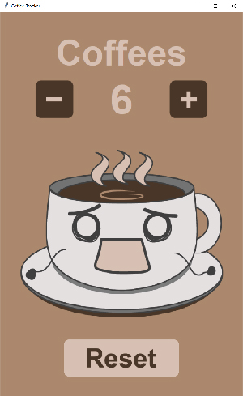
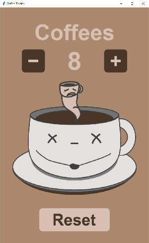

# ☕ Coffee Tracker – Interactive Cup Counter
A lightweight and fun desktop app built with **Python + Tkinter** that tracks the number of coffee cups consumed.  
The counter updates visually as the number increases, giving it a playful and engaging vibe.  
To encourage moderation, the coffee cup expressions change when the consumption exceeds a certain limit, 
making it a fun way to track and control your caffeine intake.



---

## Features
- Visual tracker that updates with each cup added
- Buttons to **add**, **remove** (if wrongly added), and **reset** the counter
- Coffee cup image changes dynamically as your count increases
- Saves progress to `data.txt` so it persists across sessions
- Simple and cozy interface

---

## Project structure
```
coffee-tracker/
├── main.py
├── data/
│   └── data.txt
├── images/
│    ├── coffee_1.png ... coffee_8.png
│    ├── button_add.png
│    ├── button_subtract.png
│    └── button_reset.png
├── readme_media/
│    ├── coffee_cover.png
│    └── screenshot_1.jpg ... screenshot_8.jpg
└── README.md
```

---

## How to Run

1. **Clone the repository**
2. **Make sure you have Python 3.10+ installed**
3. **Run the app**

_⚠️ Note: Ensure the images/ and data/ folders are in the same directory as main.py._

## Screenshots
Here’s how the app looks in action:  




---


---

## Future Updates
- Track and display daily consumption history or visualize it with graphs.

--- 

Made with 💻 and ☕